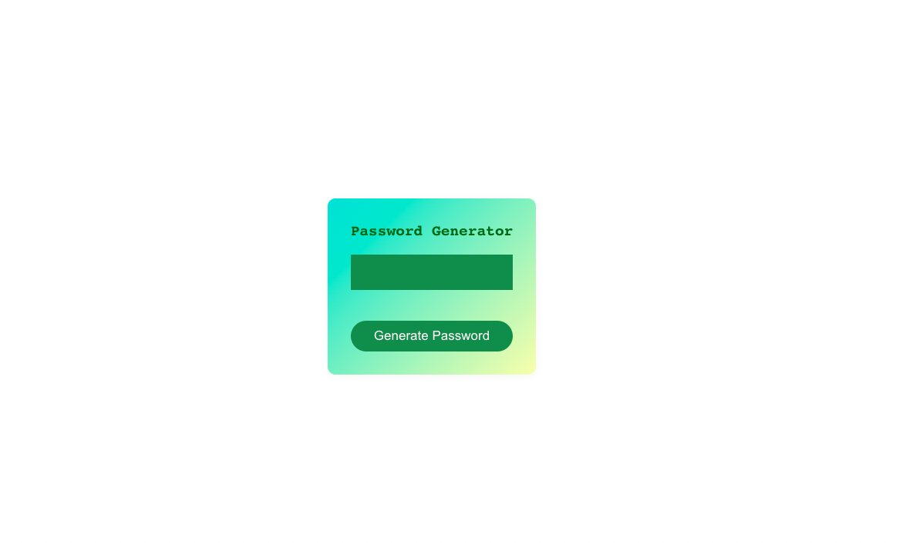

# Instructions
1. Create a password generator application that can use upper and lowercase characters, numbers, and symbols for the password.
2. The user should be able to copy the generated password to the clipboard.
3. The user should be able to select or input how long the password should be.
4. The user should be able to select or input if the password should include upper case letters (default should be lowercase letters only).
5. The user should be able to select or input if the password should include numbers.
6. The user should be able to select or input if the password should include symbols.

## Stretch goals: 
- Auto-generate a password on every state change (a password is generated without the user clicking the 'Generate Password' button).
- Add unit tests.
- Convert the app to TypeScript and add types.
- Add end-to-end tests.
- Use the styling in App.css.

This is the project when you start:

